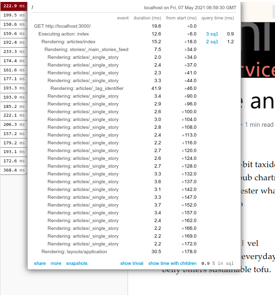
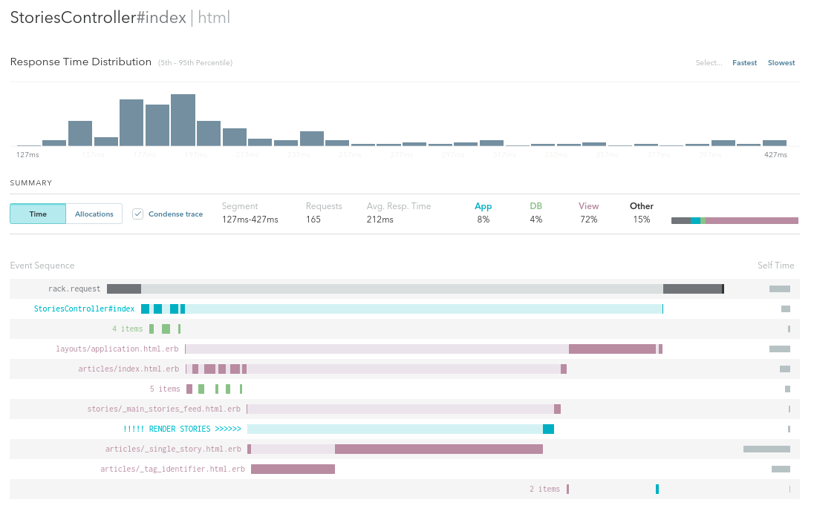
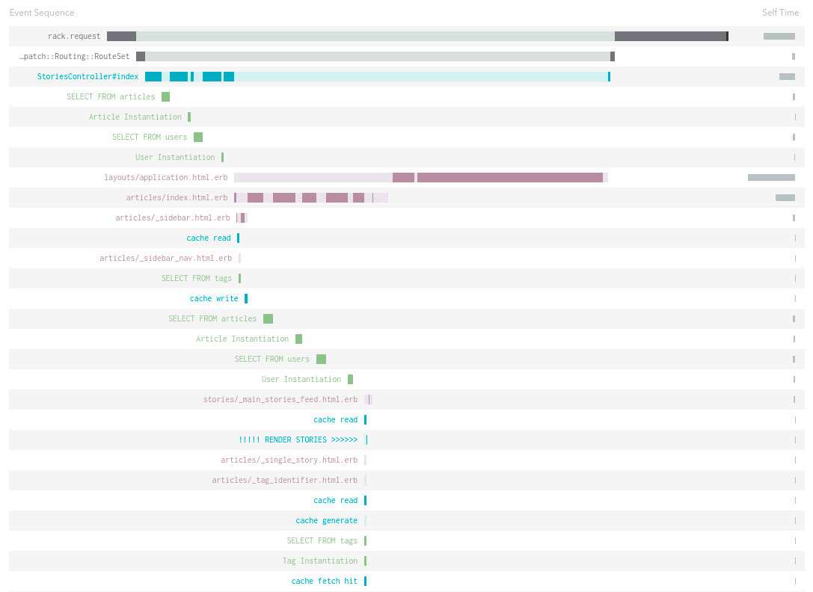

# Case Study

- [x] 1 - Завести dev.to локально (прямо в этом репозитории, не нужно
      клонировать dev.to от них, иначе будут отличаться версии)
- [x] 2 - Настроить свой NewRelic для мониторинга локального dev.to
- [x] 3 - Настроить свой Skylight / Scout / Datadog для мониторинга
      локального dev.to
- [x] 4 - Настроить свой Prometheus + Grafana для мониторинга локального dev.to
- [x] 5 - Настроить rack-mini-profiler
- [x] 6 - Настроить rails-panel
- [x] 7 - Сделать возможность запуска проекта в local_production

## 1. Завести dev.to локально

### 1.1 `Gemset`

Понадобилось поправить пути в `Gemset`: проект dev.to поменял в GitHub
название на `fastly/fastly`, используемые гемы перенеслись в новый неймспейс,
причем некоторые перестали быть актуальны и теперь отсутствуют.
Поправил пути, заменил ссылки на репозитории.

### 1.2 Algolia Search

Прописал переменные окружения. Тут все прошло штатно.

### 1.3 Авторизация через GitHub

Текущий гем `omniauth-github` работал по уже неподдерживаемой схеме авторизации:

```json
E, [2021-05-05T09:36:59.256293 #188787] ERROR -- omniauth: (github) Authentication failure! invalid_credentials: OAuth2::Error, :
{"message":"Must specify access token via Authorization header. https://developer.github.com/changes/2020-02-10-deprecating-auth-through-query-param","documentation_url":"https://docs.github.com/v3/#oauth2-token-sent-in-a-header"}
```

Пришлось обновить на версию 1.4 (минимально возможное обновление
для поддержания совместимости).

Далее, при входи через omniauth стала происходить ошибка с потерей токена формы:

```json
Processing by UsersController#onboarding_update as */*
  Parameters: {"saw_onboarding"=>"true"} [controller_call]
HTTP Origin header (http://2dev.lvh.me:3000) didn't match request.base_url (http://2dev.lvh.me:3000)
  Role Load (0.6ms)  SELECT "roles".* FROM "roles" INNER JOIN "users_roles" ON "roles"."id" = "users_roles"."role_id" WHERE "users_roles"."user_id" = $1 AND (((roles.name = 'super_admin') AND (roles.resource_type IS NULL) AND (roles.resource_id IS NULL)))  [["user_id", 11]] [sql_query]
ActionController::InvalidAuthenticityToken (ActionController::InvalidAuthenticityToken) [error]
```

Временное решение: во время авторизации отключил вызов экшена
контроллера `protect_from_forgery with: :exception, prepend: true`
в `app/controllers/application_controller.rb:2`.
Понятно, что это совсем временное решение.
В реальном проекте я бы создал отдельную задачу на восстановление
такой функциональности, так как к текущей это не особенно имеет отношение,
и есть способ обойти проблему в рамках решения текущей задачи.

## 2. Настроить свой NewRelic

Без приключений. Метрики снимаются.
Добавился `config/newrelic.yml`, ему сделан example, сам он внесен в gitignore.

## 3. Настроить свой Skylight / Scout / Datadog

Выбрал из перечисленных SkyLight, ранее не использовал, интересно попробовать.

Временно (пока нет `local_production`), включил Skylight для `development`-окружения
прямо в `development.rb`.

## 4. Настроить свой Prometheus + Grafana

Настроено с использованием `docker-compose`. Версии образов Prometheus и Grafana
взяты последние из официальных. Размещено в директории `vendor/prometheus`.
Мониторися приложение, запущенное в хосте, `prometheus_exporter` запускается там же,
добавлен в `Procfile.dev`.

## 5. Настроить rack-mini-profiler

Все штатно. Подключение через инициализатор в development-окружении.

## 6. Настроить rails-panel

Все штатно.

## 7. Сделать возможность запуска проекта в local_production

Сделал на основе development-окружения. Включение задается переменной окружения
`LOCAL_PRODUCTION`. Вся обработка идет в `development.rb`, не стал рефакторить
конфигурацию приложения, хотя можно было бы сделать класс, конфигурирующий
все окружения. Но на результат это никак не повлияло бы.

## 8. Оптимизация `StoriesController#index`

Наблюдения велись с помощью `rack-mini-profiler` (потому что больше подходит,
нагляднее для задачи) и Skylight (потому что с ним было интересно разобраться).
Практически аналогично можно бы было использовать Rails Panel вместо первого и
New Relic -- вместо второго.

### 8.1. До оптимизации

До оптимизации видно, что рендеринг `articles/_single_story` вызывается
большое число раз:


При этом с применением кастомной инструментации цикла рендеринга получаем небольшое,
но видимое влияние на ход общего выполнения:


### 8.2. Метод оптимизации

Для оптимизации применено кеширование цикла отдачи нескольких статей.
Ключ кеша создается на основе идентификаторов сущностей, влияющих на
работу тела цикла: текущего пользователя, списк отображемых статей и
`@featured_story`.

### 8.2. После оптимизации

После оптимизации стало видно, что для повторных обращений
рендеринг `stories/_main_stories_feed` стал быстрым и не вызывает рендерингов
`articles/_single_story`, что показывает эффективность кеширования:


В Skylight видно, что влияние на общее выполнение стало незначительно:


При этом заметно влияние работы рассматриваемого блока кода только для
медленных случаев, но их крайне мало на фоне общей выбоки (что показывает
эффективность кеширования):


## 9. Предложения по дальнейшей оптимизации

Дальнейшую отптимизацию проекта проводить не стал, так как не
очень располагаю свободным временем, а сам предмет достаточно
хорошо знаком и много используется в работе.

Приведу, однако, общие соображения относительно того, что уже
удалось заметить.

Заметно, что также много времени тратится в `layouts/application`.
Можно применить там блочное кеширование при рендеринге.

Для главной страницы можно также закешировать формирование
меню и подвала, возможно, частично из-за динамических данных.
Их рендеринг также заметен в отчетах RMP.

Глядя на работу приложения в целом, также заметно большое число
похожих SQL-запросов. Например, это запросы на выборки цветов тегов,
их также можно закешировать. Хотя, здесь нужно для каждого конкретного случая
предварительно проверять эффективность работы встроенного механизма
кеширования запросов Rails. И, возможно, лучше даже будет закешировать не
выполнение запроса, а рендеринг частей вьюх.
